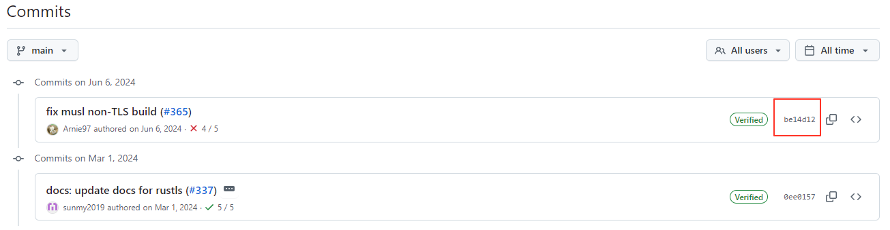
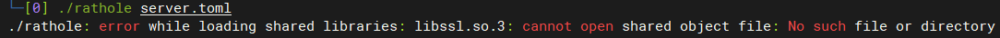

[简体中文](README.md) | [English](README-en.md)
> [rathole](https://github.com/rapiz1/rathole) 是安全、稳定、高性能的内网穿透工具，用 Rust 语言编写类似于 [frp](https://github.com/fatedier/frp) 和 [ngrok](https://github.com/inconshreveable/ngrok)，可以让 NAT 后的设备上的服务通过具有公网 IP 的服务器暴露在公网上。

基于[rathole](https://github.com/rapiz1/rathole)项目的最新（Commits on Jun 6, 2024）提交（full SHA：be14d124a22e298d12d92e56ef4fec0e51517998）进行编译，可以在CentOS7（x86_64）上运行

解决了 `./rathole: error while loading shared libraries: libssl.so.3: cannot open shared object file: No such file or directory` 报错问题

## 文件区别

- rathole：未压缩
- rathole-upx：经过upx压缩后的

